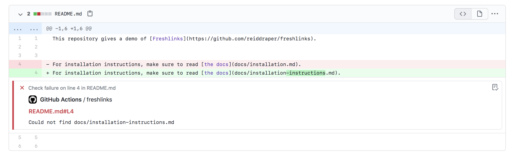
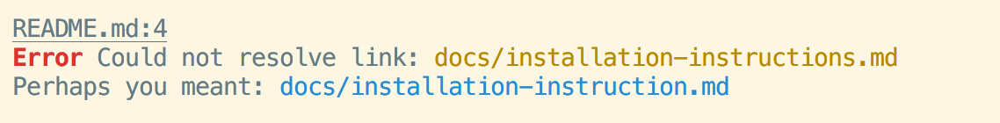

Freshlinks checks that the relative links between your markdown pages are correct, and helps keep them that way! You can use Freshlinks as a GitHub Action, where it will annotate your PR and tell you exactly where the mistaken link is. Or, you can use it from the command-line, installed with NPM.

## GitHub Action



The Freshlinks GitHub Action can be installed with adding the following workflow file:

### `.github/workflows/freshlinks.yml`

```yml
name: Freshlinks
on: [push]

jobs:
  freshlinks:
    runs-on: ubuntu-latest
    steps:
      - name: Checkout
        uses: actions/checkout@v2

      - name: Freshlinks
        uses: reiddraper/freshlinks@v0.0.5
        with:
          # Put in a glob pattern to find the
          # files you want Freshlinks to scan
          glob: "docs/**/*.md"
          # An optional bool to enable link
          # suggestions: default to `true`
          suggestions: true
          # An *optional* error message template
          # to provide your own error message to users.
          # See the rest of the README for details
          error-template: |
            Oops! You made a mistake with {{ link }}
            {{ #suggestion }}
            [Clippy] Maybe try {{ suggested_link }}?
            {{ /suggestion }}
```

### Error template syntax

A custom error message can be provided, which will be used when creating Check Annotations. This is useful if you'd like to tailor the error message to point to documentation for your organization or project.
The syntax uses [mustache](https://mustache.github.io/) templates, which are documented in more detail on the [manual page](https://mustache.github.io/mustache.5.html).

Freshlinks supports the following tags:

- `link`: The broken link, as it appeared in the markdown document
- `suggestion`: A mustache "section", to be used like `{{ #suggestion }} ... {{ /suggestion }}
- `suggested_link`: A suggested 'fix' to the link, used inside of a `suggestion` section

Here's an example:

```mustache
Oops! You made a mistake with {{ link }}
{{ #suggestion }}
[Clippy] Maybe try {{ suggested_link }}?
{{ /suggestion }}
```

The line which suggests an alternative will only be rendered if a suggestion was found.

## Command-line or Node project

Freshlinks can be used programmatically as a library, or from the command-line:

```shell
npm install --save-dev freshlinks
```

Freshlinks will scan any files provided as arguments, so you'll frequently use it like:

```
$ git ls-files '*.md' | xargs npx freshlinks
```

Freshlinks has pretty colorized output:



## [LICENSE](LICENSE)

Freshlinks is released under the MIT License.

## Changelog

View the [changelog](CHANGELOG.md) to follow new releases.
